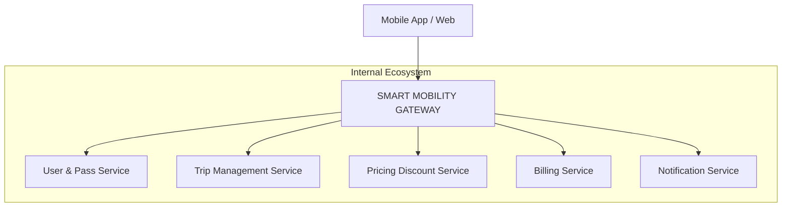

# 🚀 Smart Mobility Gateway (01)

### 🧩 Logic Architecture


Ce projet constitue la **passerelle API (API Gateway)** du système Smart Mobility. Elle est basée sur **Spring Cloud Gateway** et assure le routage, la sécurité et la redirection des requêtes vers les microservices appropriés.

---

## 🛠 Fonctionnalités Clés

*   **Routage Dynamique** : Redirige les appels vers les microservices via Eureka (Load Balancing).
*   **Sécurité Centralisée** : Agit en tant que **Resource Server OAuth2** avec validation des jetons JWT via Keycloak.
*   **Service Discovery** : Intégration complète avec l'annuaire de services **Netflix Eureka**.
*   **Configuration Externalisée** : Récupère ses paramètres dynamiquement depuis le **Spring Cloud Config Server**.
*   **Observabilité** : Traçage distribué avec **Zipkin** et monitoring via **Spring Boot Actuator**.

---

## 📋 Prérequis

*   **Java 17** ou supérieur.
*   **Maven 3.8+**.
*   **Config Server** (doit être démarré en premier sur le port 8888).
*   **Eureka Server** (doit être démarré sur le port 8761).
*   **Keycloak** (doit être accessible pour la validation JWT).

---

## ⚙️ Configuration

La Gateway utilise une configuration à deux niveaux :

### 1. Configuration Locale (`src/main/resources/application.properties`)
Définit uniquement les informations de démarrage nécessaires pour se connecter au serveur de configuration.
```properties
spring.application.name=smart-mobility-gateway-01
spring.config.import=optional:configserver:http://${CONFIG_SERVER_URL:localhost}:8888
```

### 2. Configuration Distante (`smart-mobility-configuration`)
Les paramètres opérationnels sont stockés dans le dossier de configuration centralisé :
*   `smart-mobility-gateway-01.properties` : Configuration par défaut (Local).
*   `smart-mobility-gateway-01-dev.properties` : Surcharges pour l'environnement Docker.

---

## 🛣️ Table de Routage

La Gateway expose les routes suivantes :

| Service | Préfixe de Route | URI de destination (Eureka) |
| :--- | :--- | :--- |
| **User Service** | `/users/**` | `lb://user-mobility-pass-service` |
| **Trip Service** | `/trips/**` | `lb://trip-management-service` |
| **Pricing Service** | `/api/pricing/**` | `lb://smart-mobility-pricing-service` |
| **Billing Service** | `/accounts/**` | `lb://smart-mobility-billing-service` |
| **Catalog Service** | `/api/catalog/**` | `lb://smart-mobility-user-service` |
| **Notification Service** | `/notifications/**` | `lb://notification-service` |

---

## 🔐 Sécurité

La passerelle est protégée par JWT. Elle vérifie la validité des jetons auprès du realm `smart-mobility` de Keycloak.
*   **Issuer URI (Local)** : `http://192.168.1.6:8080/realms/smart-mobility`
*   **Issuer URI (Docker)** : `http://keycloak:8080/realms/smart-mobility`

---

## 🚀 Démarrage

### En local (IDE / Maven)
1.  Assurez-vous que le Config Server et Eureka sont démarrés.
2.  Exécutez la commande suivante :
    ```bash
    mvn spring-boot:run
    ```
3.  La Gateway sera accessible sur : `http://localhost:8765`

### Via Docker Compose
Utilisez le fichier `docker-compose.yml` à la racine du projet global :
```bash
docker-compose up -d smart-mobility-gateway-01
```

---

## 📊 Monitoring

*   **Health Check** : `http://localhost:8765/actuator/health`
*   **Infos** : `http://localhost:8765/actuator/info`
*   **Zipkin Traces** : Envoyées vers `http://localhost:9411`

---

## 📝 Logs
Les logs de sécurité et de routage sont activés en mode `DEBUG` par défaut dans la configuration distante pour faciliter le diagnostic des erreurs de configuration.
