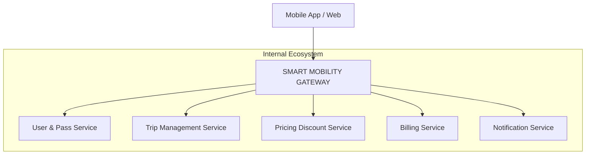

# Smart Mobility Gateways 🚀

The **Smart Mobility Gateway** is the unique entry point for the entire Smart Mobility Pass platform. No mobile or web client communicates directly with the internal microservices. Everything flows through this gateway.

---

## � Core Role: The "Front Door"

The Gateway acts as a centralized orchestrator for the ecosystem:

*   ✅ **Reverse Proxy**: Hides the internal network topology.
*   ✅ **API Router**: Directs traffic to the appropriate service.
*   ✅ **Security Layer**: Validates identity and manages access control.
*   ✅ **Traffic Controller**: Protects services from abuse (Rate Limiting).
*   ✅ **Observability Entry Point**: Initiates distributed tracing (Zipkin).

### Logic Architecture


---

## ✅ What the Gateway DOES

### � 1. Routing (Mandatory)
Redirige les requêtes vers le bon microservice en fonction du path. Le client ne connaît jamais les URIs internes.
* `/api/users/**` → `user-mobility-pass-service`
* `/api/trips/**` → `trip-management-service`
* `/api/pricing/**` → `pricing-discount-service`
* `/api/billing/**` → `billing-service`
* `/api/notifications/**` → `notification-service`

### 🔹 2. Security (Critical)
*   **Authentication**: Verifies JWT Tokens (via Keycloak or Auth Service) and rejects unauthenticated requests.
*   **Authorization**: Filters requests based on user roles (USER, ADMIN, INSPECTOR).

### 🔹 3. Rate Limiting
Prevents abuse by limiting the number of requests per user/minute (e.g., protecting Billing and Scan endpoints).

### 🔹 4. Load Balancing
Distributes traffic across multiple instances of the same service dynamically.

### 🔹 5. Observability (Zipkin & Tracing)
Initiates the trace for every request. You can follow a request from the Gateway through Trip Service, Pricing, and Billing.

### 🔹 6. CORS Management
Manages `Access-Control-Allow-Origin` to allow frontend applications to connect securely.

---

## ❌ What the Gateway DOES NOT Do

To maintain a clean and performant architecture, the gateway **MUST NOT**:
*   Contain business logic.
*   Perform pricing or tax calculations.
*   Interact with a database.
*   Manage payments or trip states.

---

## �️ Stack & Indispensable Dependencies

| Component | Technology |
| :--- | :--- |
| **Framework** | Spring Cloud Gateway (WebMVC) |
| **Security** | Spring Security + OAuth2 Resource Server (Keycloak/JWT) |
| **Service Discovery** | Netflix Eureka Client |
| **Tracing** | Micrometer Tracing + Brave + Zipkin |
| **Configuration** | Spring Cloud Config Client |

---

## 📂 Recommended Project Structure

```text
smart-mobility-gateway
│
├── config
│   ├── SecurityConfig.java   (JWT/Auth logic)
│   ├── RouteConfig.java      (Dynamic routes)
│   └── CorsConfig.java       (Frontend access)
│
├── filters
│   ├── AuthenticationFilter.java
│   ├── LoggingFilter.java
│   └── RateLimitFilter.java
│
├── application.yml           (Routing & Config Server)
└── SmartMobilityGatewayApplication.java
```

---

## � Communication Flow (Example: QR Scan)

The gateway uses **HTTP REST only** to talk to services. It does **NOT** use RabbitMQ.

1.  **User scans QR** → Request hits **Gateway**.
2.  **Gateway** verifies JWT → Routes to **Trip Management Service** (HTTP).
3.  **Trip Management** processes the scan → Emits internal **Events (RabbitMQ)**.
4.  **Pricing**, **Billing**, and **Notification** services react to these events asynchronously.

---
*Ensuring a secure, scalable, and observable entry point for Smart Mobility.*
